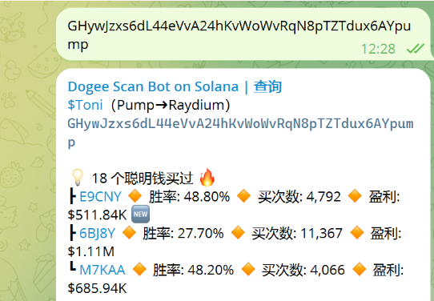
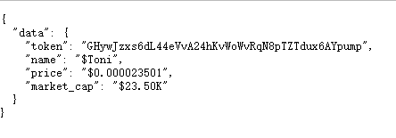

# Telegram Solana Token API

Make telegram solana token info bot as your API.

## Required
Just Telegram API secrets and put it in .env file.

## Preview

If u have a bot like this:



Now u have the API like this:




Simple but useful.

## Why
- Most of Solana's tool ecosystem revolves around the Telegram Bot.

- Most of the Telegram Bot is public, stable, and developer-welcoming.

- Most Solana Token Info APIs are expensive.

So the program is meaningful to individuals.

## How
1. Talk to the Bot based on the Telegram API.

2. Use the Telegram API to receive answers from the Bot in a Group. and extract structured data.

3. Use a message queue to complete the closure and return the results through the interface.

## Local Deployment
- Fill your .env file.

- Docker compose does the rest for you

```bash
docker compose --env-file .env up
```

## License
This work is licensed under a [GNU General Public License v3.0](https://choosealicense.com/licenses/gpl-3.0).
